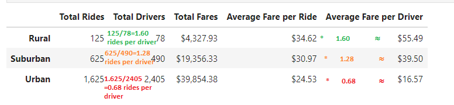

# PyBer_with_Matplotlib
## 1.	Overview of the analysis:
Create a summary report of all rides classified by type of city. with all the information of the weekly rides and their total fares for each type of city is unfolded, also required to visualize the information through a graph it could facilitate decision-making and generate positive changes.

## 2.	Results:
* chart illustrates that the quantity of money made by the service is steady over the period studied (January to May). Urban cities generate the most total revenue, followed by suburban and rural locations. When comparing urban and suburban cities, the average connection is 2:1, while the same relationship between urban and rural cities is 9:1.
 

* In the following graph we can observe all the information extracted from the data.
 

*	The “average fare per ride” of the Rural cities is $34.62 and the “average fare per driver” is $55.49, but the total rides are 125 for 78 drivers that mean each driver made 1.60 rides average. 

*	The “average fare per ride” of the Suburban cities is $30.97 and the “average fare per driver” is $39.50. the total rides are 625 for 490 drivers for suburban cities it means each driver had opportunities to made 1.28 rides average. 

*	Finally, the “average fare per ride” of the urban cities is $24.53 and the “average fare per driver” is $16.57. the total Rides are 1,625 for urban cities for 2,405 drivers, this means the driver had only 68% chance of made a ride. 

* The total drivers are 2.973 of all city types. Urban cities have the most drivers with 2.405 this represents 80.9% of all drivers, in second place Suburban cities with 490 drivers that means 16.5% of all drivers, and finally Rural cities have 78 drivers for a 2.6%. 

 

* The total Rides are 2.375 of all city types. Urban cities have the most rides demand with 1625 this represents 68.4% of all rides, in second place Suburban cities with 625 rides that means 26.3% of all rides demand, and finally Rural cities have 125 rides for a 5.3 %.

 

* The total fares are $63,538.64 of all city types. Urban cities have the highest total fares with $39,854.38 this represents 62.7% of total fares, in second place Suburban cities with $19,356.33 that means 30.5% of total fares, and finally Rural cities have $4,327.93 for a 6.8 %.

 

## 3.	Summary:
### o	business recommendations to the CEO:

1. standardize fares according to the distance in relation to the payment to the drivers and not according to the type of city.
2. Create an annual membership to get benefic like access rides with cheaper rates compared to the current ones offered.
3. Carry out a market study to determine the real demand for rides and see if it is feasible to hire or reduce drivers in certain areas.
